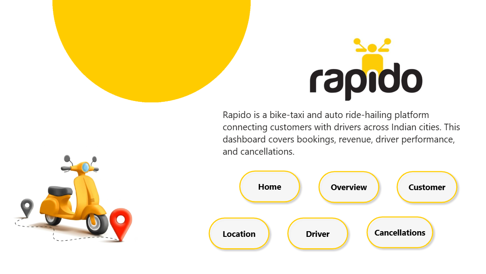
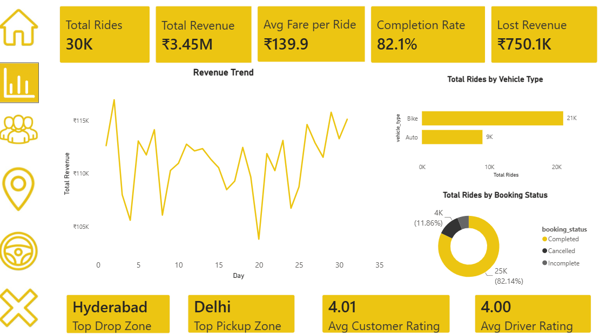
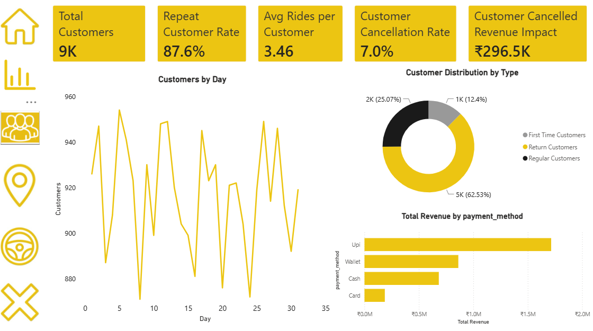
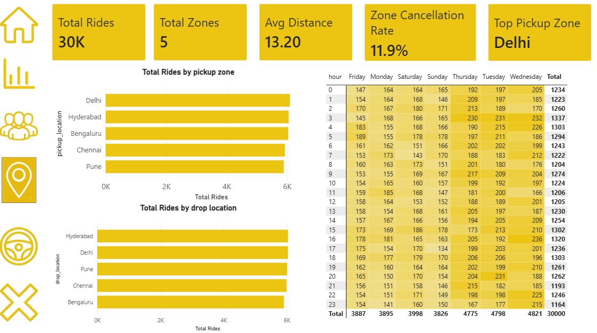
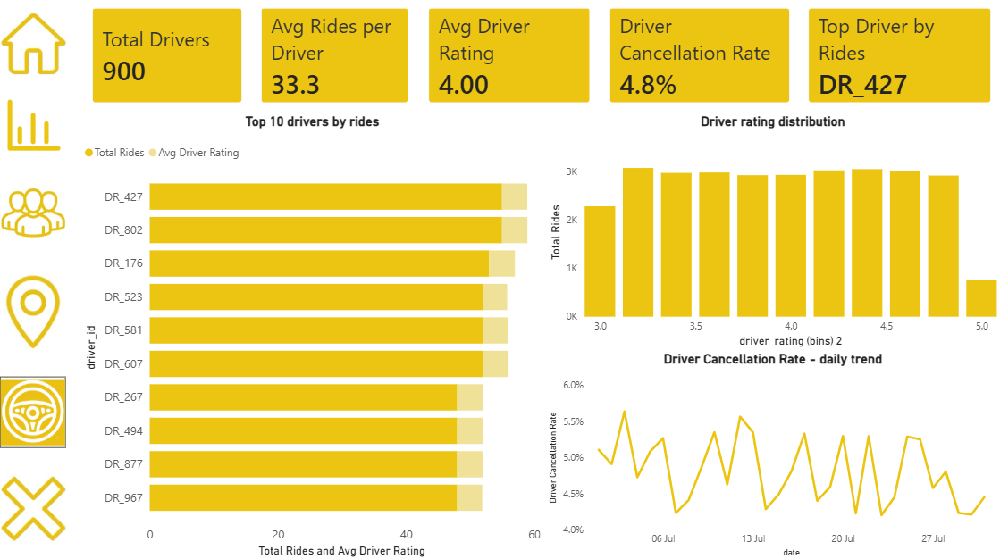
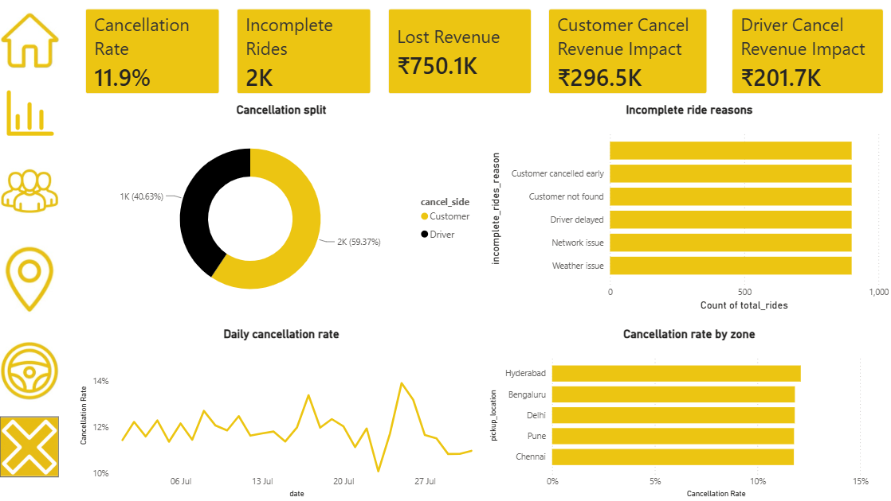

# 🛵 Rapido Ride Analytics Dashboard – Business Analytics Project

An end-to-end **Power BI analytics dashboard** designed to analyze Rapido ride-hailing data and deliver actionable insights across **bookings, revenue, drivers, customers, and locations**.
This project focuses on **business-driven analytics**, data modeling, DAX calculations, and professional dashboard design.

---

## 📥 Dashboard Access

This dashboard is not published to Power BI Service — download and open the `.pbix` file in [Power BI Desktop](https://powerbi.microsoft.com/desktop/) (free) to explore all 6 pages interactively, including working navigation, slicers, and drill-throughs.

📂 [`powerbi/Rapido_Dashboard.pbix`](powerbi/Rapido_Dashboard.pbix)

---

## 📌 Project Overview

Rapido operates a bike-taxi and auto ride-hailing platform across Indian cities, generating high volumes of daily ride transactions. Managing such operations requires transforming raw ride data into **meaningful insights** that support decision-making.
This project addresses key business questions related to **performance monitoring, revenue optimization, driver performance, customer behavior, and operational efficiency** using Microsoft Power BI.

---

## 🎯 Business Objectives

- Monitor overall ride and revenue performance
- Identify revenue drivers and cancellation-driven losses
- Analyze driver-level performance and utilization
- Understand customer behavior, retention, and cancellation impact
- Identify peak demand zones and time slots
- Enable data-driven operational and strategic decisions

---

## 📂 Dataset Overview

The dataset represents **ride-level transactional data** and includes:

- Booking details (Booking ID, Status, Value)
- Vehicle types (Bike, Auto)
- Customer and driver identifiers
- Pickup and drop zones
- Distance and trip duration
- Time and date attributes
- Ratings and cancellation attribution (customer-side vs driver-side)

Data covers a single month (July 2025); trends are analyzed at the **daily and day-of-week** level. See [`data/SOURCE.md`](data/SOURCE.md) for full dataset provenance and known limitations.

---

## 🧱 Dashboard Architecture

The dashboard is structured into **six pages**, each serving a specific business requirement:

1. Home
2. Overview
3. Customer
4. Location
5. Driver
6. Cancellations

Interactive navigation buttons and a sidebar icon rail allow seamless movement between pages, with the active page visually highlighted.

---

## 📊 Page-wise Business Explanation

---

### 1️⃣ Home Page

**Purpose**
- Introduces the Rapido analytics dashboard
- Provides context and navigation for users

**Key Features**
- Rapido branding and visual identity
- Brief description of dashboard purpose
- Navigation buttons to all analytical pages

**Business Value**
- Improves user experience
- Makes the dashboard portfolio and stakeholder-ready

---

---

### 2️⃣ Overview Page

**Business Requirement**
Provide a high-level snapshot of Rapido's operational and financial performance.

**KPIs Displayed**
- Total Rides
- Total Revenue
- Average Fare per Ride
- Completion Rate
- Lost Revenue

**Insights Provided**
- Daily revenue trend
- Rides by vehicle type (Bike vs Auto)
- Booking status split (Completed/Cancelled/Incomplete)
- Top pickup and drop zones
- Average customer and driver ratings

**Business Value**
- Enables quick executive-level decision-making
- Identifies overall growth, decline, or inefficiencies

---

---

### 3️⃣ Customer Page

**Business Requirement**
Understand customer behavior, loyalty, and cancellation impact.

**Customer Segmentation**
- First-time customers (12.4%)
- Return customers (62.5%)
- Regular customers (25.1%)

**Key Metrics**
- Total Customers
- Repeat Customer Rate
- Average Rides per Customer
- Customer Cancellation Rate
- Customer Cancelled Revenue Impact

**Insights Provided**
- Daily active customer trend
- Revenue by payment method
- Customer distribution by segment

**Business Value**
- Improves customer retention strategies
- Reduces revenue loss due to cancellations
- Highlights where retention efforts are best targeted

---

---

### 4️⃣ Location Page

**Business Requirement**
Analyze geographic and time-based demand patterns.

**Key Insights**
- Total rides by pickup zone
- Total rides by drop zone
- Hour × day-of-week demand heatmap
- Top pickup zone identification

**Business Value**
- Optimizes driver allocation across zones
- Identifies peak demand windows for supply planning
- Supports zone-level operational decisions

---

---

### 5️⃣ Driver Page

**Business Requirement**
Analyze driver-level performance to support fleet and driver management.

**Key Metrics**
- Total Drivers
- Average Rides per Driver
- Average Driver Rating
- Driver Cancellation Rate
- Top Driver by Rides

**Insights Provided**
- Top 10 drivers by ride volume and rating
- Driver rating distribution
- Daily driver cancellation rate trend

**Business Value**
- Identifies top-performing drivers for recognition/incentives
- Flags drivers with elevated cancellation rates for follow-up
- Supports driver utilization planning

---

---

### 6️⃣ Cancellations Page

**Business Requirement**
Quantify the business impact of cancellations and identify root causes.

**Key Metrics**
- Cancellation Rate
- Incomplete Rate
- Lost Revenue
- Customer Cancel Revenue Impact
- Driver Cancel Revenue Impact

**Insights Provided**
- Cancellation split (customer-side vs driver-side)
- Incomplete ride reason breakdown
- Daily cancellation rate trend
- Cancellation rate by zone

**Business Value**
- Converts a vague "cancellation %" into a concrete ₹ business-impact figure
- Identifies whether cancellation reduction efforts should target customers or drivers
- Surfaces the specific operational reasons behind incomplete rides

---

---

## 🛠 Tools & Technologies Used

- **Microsoft Power BI** (Data Modeling, DAX, Interactive Dashboard)
- **Microsoft Excel** (Power Query, Pivot Tables, Interactive Pivot Dashboard)
- **PostgreSQL** (hosted on Supabase) — relational storage and SQL analysis
- **Python (Pandas)** — data cleaning and star-schema normalization, via Google Colab
- Data Modeling & Star Schema Relationships
- KPI Design & Dashboard UX Principles

---

## 📈 Business Impact

This dashboard enables Rapido stakeholders to:

- Track ride and revenue performance in near real time
- Identify cancellation-driven revenue loss and its root cause
- Improve driver utilization and recognize top performers
- Understand and improve customer retention
- Make informed, data-driven zone and demand-planning decisions

---

## 📚 Key Learnings

- End-to-end analytics pipeline: raw data → SQL → Excel → Power BI
- Star-schema data modeling and its practical trade-offs
- Practical use of DAX for real-world business questions
- Data validation across independent tools (Excel and Power BI results cross-checked and matched)
- Data storytelling and professional dashboard design
- Honest scoping — documenting dataset limitations rather than overstating findings

---

## 🚀 Future Enhancements

- Multi-month data for real trend/seasonality analysis
- Driver idle-time and positioning data for deadheading analysis
- Predictive demand forecasting
- Customer churn prediction
- In-app cancellation-reason capture to close the current data gap on *why* customers cancel
- Publish to Power BI Service for a live shareable link

---

## 👤 Author

**Adepu Tejaswini**
Aspiring Data Analyst | SQL | Excel | Power BI

📌 GitHub Repository:
https://github.com/AdepuTejaswini9/Rapido-Ride-Analytics-Dashboard.git

---

## 📎 Note

This project is created for **learning, portfolio, and demonstration purposes** using a public dataset of 30,000 rows and 25 features ([RAPIDO_DATA_2025](https://www.kaggle.com/datasets/vengateshvengat/rapido-all-data), Kaggle). It is not built on official Rapido production data — see [`data/SOURCE.md`](data/SOURCE.md) for full details.
